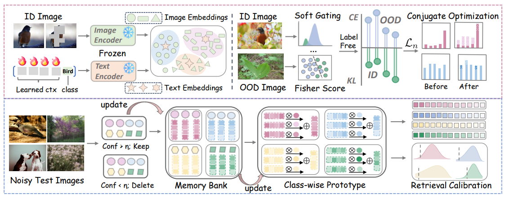

# STAR
Code for "STAR: Test-Time Adaptation Can Enhance Universal Prompt Learning for Vision-Language Models"

## Overview



## Abstract
This paper studies the problem of universal prompt learning at test-time for vision-language models (VLMs), aiming to enhance the adaptation of pre-trained VLMs to noisy unlabeled target data comprising both in-distribution (ID) and our-of-distribution (OOD) instances. However, existing test-time adaptation approaches often rely on unreliable pseudo-labels due to inadequate uncertainty estimation and overlook class-specific diversity in the target domain, which may result in additional adaptation bias during test time. Motivated by this, we propose a novel framework named Separability-aware Conjugate Optimization with Prototypical Retrieval (STAR) for universal test-time prompt learning of VLMs. The core of our STAR is to incorporate a separability-aware gating mechanism into conjugate optimization for reliable pseudo-learning with OOD samples. In particular, we first compute the Fisher score to quantify the separability between ID and OOD samples, which guides our soft gating mechanism for divided training. Then, we employ conjugate optimization to derive reliable pseudo-labels of unlabeled data for test-time adaptation. To further mitigate biases in OOD detection, we maintain a dynamic memory bank which stores high-confidence samples to build class-wise prototypes, which would serve as queries for prototypical retrieval to calibrate OOD detection. Extensive experiments on multiple benchmarks demonstrate that STAR consistently outperforms competing baselines.

## Datasets
Please create `data` folder and download the following ID and OOD datasets to `data`.
We use ImageNet-1K as the ID dataset, and iNaturalist, SUN, Texture, and Places as the OOD datasets.

## Quick Start
e.g., 1-shot based on LoCoop and SCT
```
## change the corresponding data path
bash run.sh
```

## Acknowledgement
We are grateful to the following papers, which provide an important foundation for our work:
* [LoCoOp: Few-Shot Out-of-Distribution Detection via Prompt Learning (NeurIPS2023)](https://arxiv.org/abs/2306.01293).
* [Self-Calibrated Tuning of Vision-Language Models for Out-of-Distribution Detection (NeurIPS2024)](https://arxiv.org/pdf/2411.03359)
## Citation
If you find our work helpful, please consider citing it:
```bibtex
@inproceedings{fu2026star,
  title={STAR: Test-Time Adaptation Can Enhance Universal Prompt Learning for Vision-Language Models},
  author={Fu, Yiwei and Wan, Hui and Luo, Xiao and Deng, Minghua},
  booktitle={Proceedings of the IEEE/CVF Conference on Computer Vision and Pattern Recognition},
  pages={31482--31492},
  year={2026}
}
```
